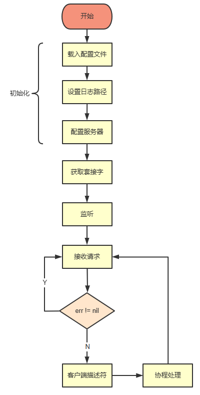

# gTCP

基于 aceld/zinx 重构的轻量级TCP框架

由衷感谢 无崖子 刘丹冰 老师 😘

| src | desc |
| - | - |
| 源代码 | <https://github.com/aceld/zinx/> |
| 视频 | <https://www.bilibili.com/video/BV1wE411d7th/> |
| 文档 | <https://www.yuque.com/aceld/npyr8s/bgftov> |

## v1

实现文件配置

实现简单的 TCP 连接请求处理并 echo 内容的并发服务器  

## v2

消息封装 -> TLV -> 粘包问题

<https://upload-images.jianshu.io/upload_images/16626678-ef4a860d25c505ba.png?imageMogr2/auto-orient/strip|imageView2/2/format/webp>

<https://blog.csdn.net/Ternence_zq/article/details/105757272>

单元测试有bug, 无法自动退出

深入理解 io.Reader 接口 <https://juejin.cn/post/7118633163022139399>

## v3

服务器 对 clientfd 的多个 msg 读写分离 并发处理

除 main 结束 或 exit() 外，不能显示退出协程 -> 如何避免内存泄漏，且同步退出子协程

同步协程：
1. sync.WaitGroup 计数等待
2. channel 关闭 且 确保读完（只许发送方关闭channel）

修补单元测试

### ERROR 日志分析

测试客户端主动关闭连接后，其子协程 readMsg() 在读操作中：

ERROR: use of closed network connection

为正常日志
